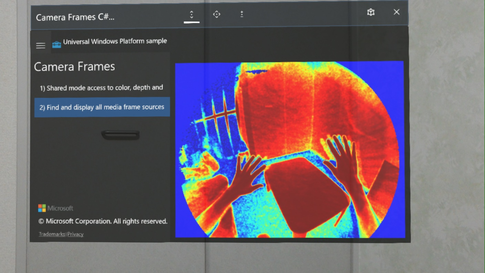
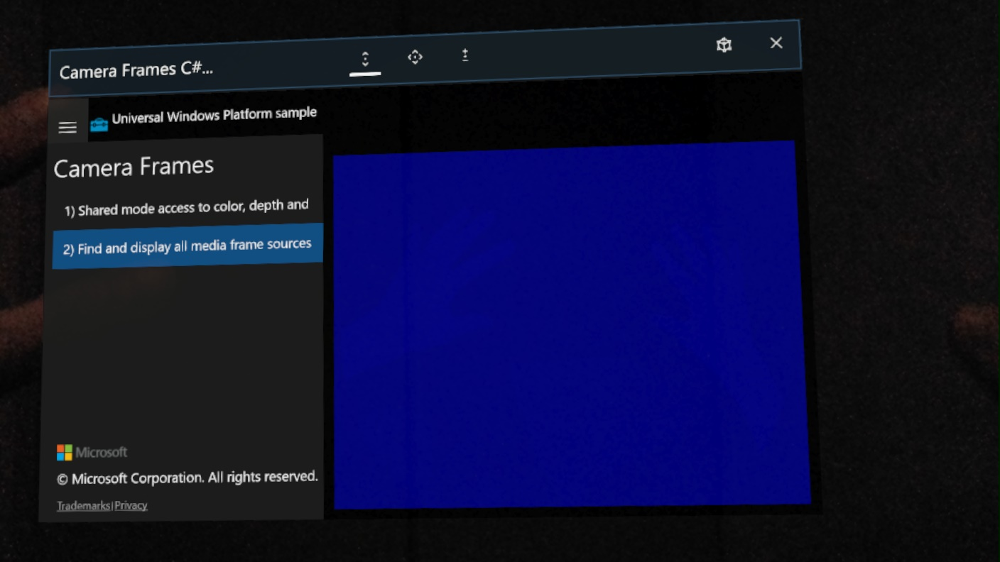

# Camera frames sample for HoloLens RS4 Preview

This sample is modified to access low-level HoloLens sensor streams using Research mode.  
https://github.com/Microsoft/Windows-universal-samples/tree/master/Samples/CameraFrames

## Development Environments
- Windows 10 Pro Insider Preview (Version: 1803, OS build: 17127.1)
- Visual Studio Community 2017 (Version 15.6.6)
- HoloLens RS4 Preview (OS build: 10.0.17123.1004)
